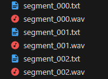
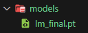

# MusicGen Trainer

Wrapper code for running MusicGen training. Source preserved and enhanced from a now-deleted repository.

## Usage

### Dataset Creation

Create a folder, and place audio and caption files in it. **They must be in `.wav` and `.txt` formats respectively.**

Example caption for the `.txt` file: *"jazz music, jobim"*

You may omit `.txt` files for training with empty text by setting the `--no_label` option to `1`.



**NOTE:** If you use `.wav` files longer than 30 seconds, the model will be trained on its random crops.

### Running the trainer

Run `python3 run.py --dataset <PATH_TO_YOUR_DATASET>`. Make sure to only use an absolute path.

### Options

- `dataset_path`: String, path to your dataset with `.wav` and `.txt` pairs.
- `model_id`: String, MusicGen model to use. Can be `facebook/musicgen-` `small`/`medium`/`large`. Default: `facebook/musicgen-small`
- `lr`: Float, learning rate. Default: `0.00001`/`1e-5`
- `epochs`: Integer, epoch count. Default: `100`
<!-- - `use_wandb`: Integer, `1` to enable wandb, `0` to disable it. Default: `0` = Disabled -->
- `save_step`: Integer, amount of steps to save a checkpoint. Default: None
- `no_label`: Integer, whether to read a dataset without `.txt` files. Default: `0` = Disabled
- `tune_text`: Integer, perform textual inversion instead of full training. Default: `0` = Disabled
- `weight_decay`: Float, the weight decay regularization coefficient. Default: `0.00001`/`1e-5`
- `grad_acc`: Integer, number of steps to smooth gradients over. Default: 2
- `warmup_steps`: Integer, amount of steps to slowly increase learning rate over to let the optimizer compute statistics. Default: 16
- `batch_size`: Integer, batch size the model sees at once. Reduce to lower memory consumption. Default: 4
- `use_cfg`: Integer, whether to train with some labels randomly dropped out. Default: `0` = Disabled

You can set these options like this: `python3 run.py --model_id=facebook/musicgen-small`.

### Models

Once training finishes, the model (and checkpoints) will be available under the `models` folder in the same path you ran the trainer on.



To load them, simply run the following on your generation script:

```python
model.lm.load_state_dict(torch.load("models/lm_final.pt"))
```

Where `model` is the MusicGen Object and `models/lm_final.pt` is the path to your model (or checkpoint).

## Currently broken
- Only works for overfitting. Breaks model on anything else.
- Commented out weights & biases support.